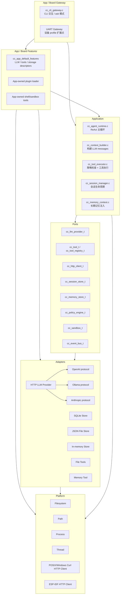
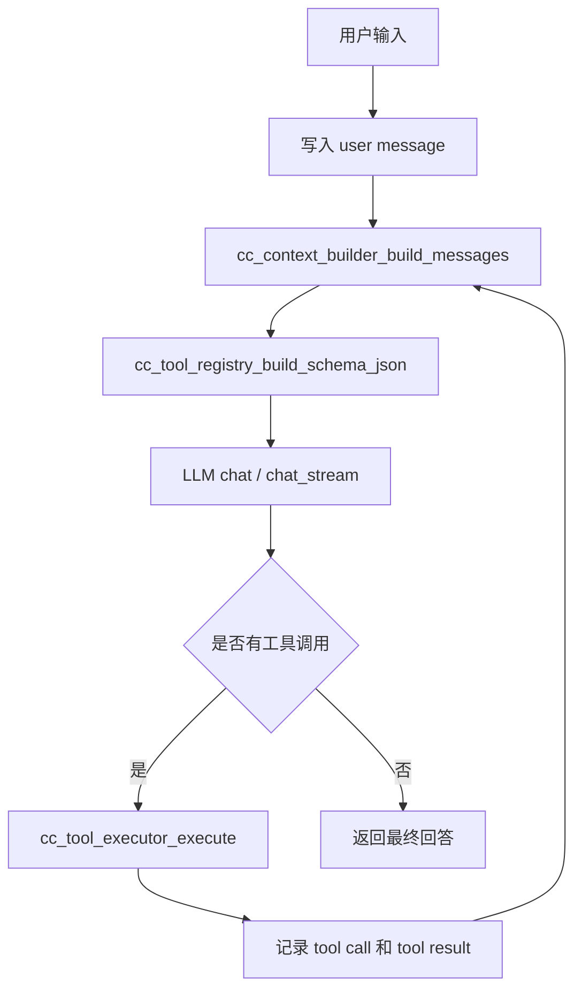
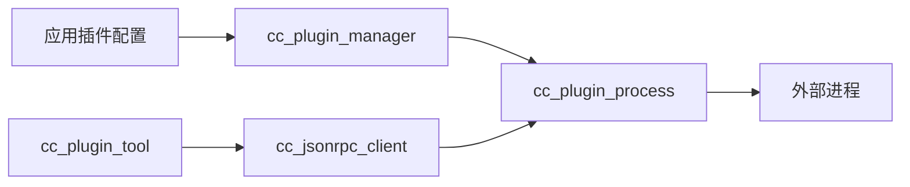

# c-claw 架构设计文档

## 1. 设计目标

c-claw 是一个纯 C 语言 AI Agent runtime。核心目标是把 Agent 主循环、
存储、工具、LLM、平台能力拆成稳定边界，使代码可以在桌面、服务器和受限设备
之间迁移。

主要原则：

- **端口隔离**：上层只依赖 `cclaw/ports/include/cc/ports` 中的 vtable 接口。
- **适配器注入**：OpenAI、Ollama、Anthropic、SQLite、JSON 文件、Shell、插件等能力都作为适配器注入。
- **平台抽象**：文件系统、路径、线程、进程等通过 `cclaw/ports/include/cc/ports` 封装。
- **构建裁剪**：CMake profile 决定哪些能力被编入，未编入能力不能在运行时开启。
- **生命周期清晰**：`create -> use -> destroy`，谁创建谁释放。
- **错误优先**：返回 `cc_result_t` 的函数必须传播错误，错误消息由调用方释放。

## 2. 分层架构



`apps/posix/cli/src/main.c` 是 POSIX CLI app 的最小入口：加载配置、创建
`cc_runtime_builder`、启动 CLI gateway。LLM、storage、sandbox、内置工具和
插件工具由 `cc_runtime_feature_set_t` descriptor / factory 路径统一装配。
`cclaw/core` 只遍历 descriptor，不直接引用 OpenAI/Ollama/Anthropic/tool/plugin 的
具体工厂。后续新增应用入口时，应复用 c-claw SDK 和 runtime builder，只替换
gateway、app feature set 和 profile 配置。

## 3. VTable 多态

项目使用统一模式表达接口：

```c
typedef struct cc_tool {
    void *self;
    const cc_tool_vtable_t *vtable;
} cc_tool_t;

struct cc_tool_vtable {
    const char *(*name)(void *self);
    const char *(*description)(void *self);
    const char *(*schema_json)(void *self);
    cc_result_t (*call)(
        void *self,
        const char *args_json,
        const cc_tool_context_t *ctx,
        cc_tool_result_t *out_result
    );
    void (*destroy)(void *self);
};
```

调用方只持有 `cc_tool_t`，不知道具体实现是文件工具、Shell 工具、memory 工具还是
插件桥接工具。

同样模式用于：

- `cc_llm_provider_t`
- `cc_session_store_t`
- `cc_memory_store_t`
- `cc_sandbox_t`
- `cc_policy_engine_t`

LLM 适配采用两层策略：`cc_http_llm_provider` 负责通用 HTTP 生命周期
（headers/body 发送、状态码处理、stream 分帧），OpenAI/Ollama/Anthropic 只实现
协议策略，负责构造 URL、headers、JSON body，并把同步响应或流式事件解析回统一
`cc_llm_response_t` / `cc_stream_chunk_t`。因此新增一个 HTTP LLM 协议不需要再复制
transport 或 SSE/NDJSON framing 代码。

## 4. Agent 主循环



关键设计：

- 每轮都从 session store 重建 messages，而不是维护内存消息列表。
- 工具结果写入存储，下一轮 LLM 能看到 observation。
- 流式路径会发布 stream 事件，并在工具调用完成后继续循环。
- 上下文过长时由 `cc_context_builder` 做 token 截断和可选摘要压缩。

消息模型已经结构化：`cc_message_t` 将用户可见 `content`、assistant
`tool_calls_json`、`reasoning_content` 和 tool `tool_call_id` 分字段存储。
上下文构建时再序列化为 LLM API 所需的 messages JSON，不再把 tool_calls 或
reasoning_content 包进 content 字符串中。

## 5. 构建 Profile 和能力宏

CMake 提供目标平台和功能开关：

```bash
cmake --preset posix-cli
cmake --preset core-minimal
./scripts/esp32_s3_qemu.sh qemu
```

`CC_PROFILE` 负责选择 app/board、目标平台、默认路径和能力集合。

核心平台值：

| 平台 | `CC_PLATFORM` | 说明 |
|------|---------------|------|
| POSIX | `100` | Linux、macOS、BSD 等桌面/服务器环境 |
| Windows | `200` | Win32 / MSVC / MinGW |
| ESP32 | `300` | FreeRTOS / ESP-IDF 设备 profile |

功能开关会生成同名编译宏：

| CMake 选项 | 编译宏 | 影响 |
|------------|--------|------|
| `CC_ENABLE_SHELL` | `CC_TOOL_SHELL_RUN`, `CC_SANDBOX_LOCAL` | Shell 工具和 local sandbox |
| `CC_ENABLE_PLUGIN` | `CC_TOOL_PLUGIN` | 外部进程插件系统 |
| `CC_ENABLE_SQLITE` | `CC_STORAGE_SQLITE` | SQLite 会话存储和记忆后端 |
| `CC_ENABLE_OPENAI` | `CC_LLM_OPENAI` | OpenAI 兼容 provider |
| `CC_ENABLE_OLLAMA` | `CC_LLM_OLLAMA` | Ollama provider |
| `CC_ENABLE_ANTHROPIC` | `CC_LLM_ANTHROPIC` | Anthropic provider |
| `CC_ENABLE_CLI` | `CC_GATEWAY_CLI` | CLI gateway |
| `CC_ENABLE_MEMORY` | `CC_HAS_MEMORY` | 长期记忆工具 |
| `CC_ENABLE_HTTP_TOOL` | `CC_TOOL_HTTP_REQUEST` | HTTP 请求工具 |

平台端口能力和 app 功能宏分开：

- `CC_HAS_PROCESS_RUN`：能启动一次性外部进程。
- `CC_HAS_PROCESS_PIPE`：能启动带 stdin/stdout 的长期子进程。
- `CC_HAS_FORK`：是否有 POSIX fork，不再等同于“能执行进程”。
- `CC_HAS_NETWORK`、`CC_HAS_THREADS` 等描述底层能力。

curl 不再是全局 adapter：POSIX 和 Windows 平台目录各自提供 curl 头文件兜底、
查找系统 libcurl，并编入自己的 `cc_http_client` 实现；ESP32 使用 ESP-IDF
HTTP client。

同一个 build 目录只能绑定一个 `CC_TARGET_PLATFORM`。切换平台需要新 build
目录，避免 CMake cache 中的功能开关跨 profile 泄漏。

这让 Windows 可以通过 `CreateProcess` 支持 shell/plugin，而不需要伪装成有 `fork`。

## 6. 存储系统

会话存储统一为 `cc_session_store_t`：

| 后端 | 编译条件 | 适用场景 |
|------|----------|----------|
| SQLite | `CC_STORAGE_SQLITE=1` | 桌面/服务器，持久化和并发更强 |
| JSON 文件 | 总是可用 | 轻量部署、脚本、小设备文件系统 |
| Memory | 总是可用 | 测试、临时会话、受限设备 |

`cc_storage_factory_create_store()` 根据 `config.storage.type` 选择后端。
当配置选择 `sqlite` 但编译禁用或初始化失败时，会降级到 JSON 文件。

长期记忆使用独立的 `cc_memory_store_t`：

- `json_file`
- `sqlite`，需要 `CC_STORAGE_SQLITE=1`
- `inmem`
- `noop`

## 7. 工具系统

工具统一注册到 `cc_tool_registry_t`。注册完成后调用 `cc_tool_registry_freeze()`，
防止运行期结构被修改。

| 工具 | 编译条件 | 名称 |
|------|----------|------|
| 文件读取 | `CC_TOOL_FILE_READ` | `file_read` |
| 文件写入 | `CC_TOOL_FILE_WRITE` | `file_write` |
| Shell | `CC_TOOL_SHELL_RUN` | `shell_run` |
| 长期记忆 | `CC_HAS_MEMORY` | `memory` |
| HTTP 请求 | `CC_TOOL_HTTP_REQUEST` | `http.request` |
| 插件工具 | `CC_TOOL_PLUGIN` | 由 `plugins.json` 决定 |
| Hardware IO | app feature set | 例如 ESP32-S3 QEMU 的 `gpio` |

工具实现按依赖边界分层：通用工具在 `cclaw/adapters/src/tools/common`，桌面应用工具在
`apps/<platform>/cli/src/tools`，硬件工具在 `apps/<mcu>/<board>/main/tools`。
`cclaw/platforms/*` 只提供 port 适配，不拥有 agent tool。

运行时 `tools.enabled` 可以进一步过滤内置工具。常用别名：

- `read` -> `file_read`
- `write` -> `file_write`
- `shell` -> `shell_run`

## 8. 插件系统

插件系统依赖 `CC_TOOL_PLUGIN=1` 和可用的 process pipe 端口。

流程：



协议：

- 每行一个 JSON-RPC 2.0 请求或响应。
- 主进程写 stdin，插件写 stdout。
- 插件 stderr 不作为协议通道。

插件的解释器和运行环境由 app 私有 `plugins.json` 的 `command` 和 `args` 决定，例如
`python3 apps/posix/cli/plugins/weather_tool.py`。插件不共享主进程 sandbox，需要依赖操作系统权限
和用户自己的隔离策略。

## 9. 平台层

平台层文件：

```text
cclaw/ports/include/cc/ports/
  cc_platform.h
  cc_platform_check.h
  cc_filesystem.h
  cc_path.h
  cc_process.h
  cc_thread.h

cclaw/platforms/
  posix/
  windows/
  esp32/
```

当前 `cc_filesystem_get_default()` 返回当前平台默认文件系统实现；
`cc_filesystem_get_posix()` 保留为兼容旧调用点的别名。

新增设备时优先新增平台端口 adapter 和 app feature set，而不是让 `cclaw/core`
直接包含设备 SDK 头文件。

## 10. 沙箱和策略

`cc_policy_engine_t` 在工具执行前做风险判断。默认策略会对 shell 执行按配置要求审批。

`cc_sandbox_t` 是命令执行抽象。当前实现：

| 沙箱 | 编译条件 | 说明 |
|------|----------|------|
| Local | `CC_SANDBOX_LOCAL=1` | 调用 `cc_process_run`，桌面开发使用 |
| Docker | `CC_SANDBOX_DOCKER=1` | 通过 Docker CLI 隔离执行，可由 `sandbox.type=docker` 选择 |

Shell 工具持有自己的 sandbox 副本，销毁工具时也会销毁该 sandbox。

## 11. 事件系统

`cc_event_bus_t` 支持按事件名订阅，也支持 `NULL` 通配订阅。

常见事件：

| 事件 | 触发时机 |
|------|----------|
| `llm.request.started` | LLM 请求前 |
| `llm.response.received` | LLM 响应后 |
| `tool.call.started` | 工具执行前 |
| `tool.call.finished` | 工具执行后 |
| `agent.finished` | Agent 完成 |
| `stream.thinking` | 流式思考片段 |
| `stream.text` | 流式文本片段 |
| `stream.tool.start` | 流式工具调用开始 |
| `stream.tool.end` | 流式工具调用结束 |
| `stream.finished` | 流式响应结束 |

CLI gateway 用这些事件渲染流式输出。

## 12. 配置系统

`cc_config_load()` 读取 profile 指定的配置路径，字段缺失则使用默认值。默认值由编译 profile
决定：

- 桌面默认 provider 优先使用 `openai`。
- 只启用 Anthropic 时默认 provider 是 `anthropic`。
- 只启用 Ollama 时默认 provider 是 `ollama`。
- 禁用 SQLite 时默认 storage 是 `json`。
- 禁用 memory 时默认 memory backend 是 `noop`。
- POSIX/Windows CLI 默认数据和工作区在 `build/<profile>/apps/<platform>/cli/runtime/...`。
- ESP32 QEMU 默认数据和工作区在 `/sdcard/cclaw/...`。

详见 [../../apps/posix/cli/docs/config.md](../../apps/posix/cli/docs/config.md)。

## 13. 扩展指南

### 新增 LLM Provider

1. 为目标 API 实现 `cc_llm_protocol_vtable_t`：`build_request` 和 `parse_response`。
2. 在 factory 中调用 `cc_http_llm_provider_create()` 组合通用 HTTP provider。
3. 在 CMake 中增加功能开关和源文件选择。
4. 在目标 app/board 的 `cc_runtime_feature_set_t` provider descriptor 中声明配置名。

### 新增内置工具

1. 实现 `cc_tool_vtable_t`。
2. 添加工厂函数，例如 `cc_my_tool_create()`。
3. 按依赖选择位置：通用工具放 `cclaw/adapters/src/tools/common`，桌面能力放对应 app，硬件能力放对应 embedded app。
4. 在 CMake 中增加功能开关。
5. 在目标 app/board 的 `cc_runtime_feature_set_t` tool descriptor 表中声明 name、alias、编译宏和注册函数。

### 新增设备

1. 在 `cclaw/platforms/<device>` 添加 filesystem/path/thread/process 等必要端口实现。
2. 在 `cclaw/platforms/<device>/CMakeLists.txt` 封装平台源码和 SDK 依赖。
3. 在根 CMake 中添加 `CC_TARGET_PLATFORM` 映射和 platform 子目录。
4. 新增 app/board feature set，注册该设备实际编入的 LLM、工具、存储和 gateway 能力。
5. 新增 `cclaw/profiles/<device-or-app>.cmake` 关闭设备不支持的功能。
6. 新增 gateway 或复用已有 gateway，具体固件工程放在 `apps/<mcu>/<board>`。

## 14. 当前限制

- POSIX/Windows HTTP client 使用平台私有 curl 实现；ESP32 使用 ESP-IDF HTTP client。
- ESP32 QEMU board 已提供 smoke test 和 UART chat；真实硬件需要单独的 SDMMC/SDSPI board mount。
- 插件系统依赖外部进程和管道，不适用于无进程模型设备。
